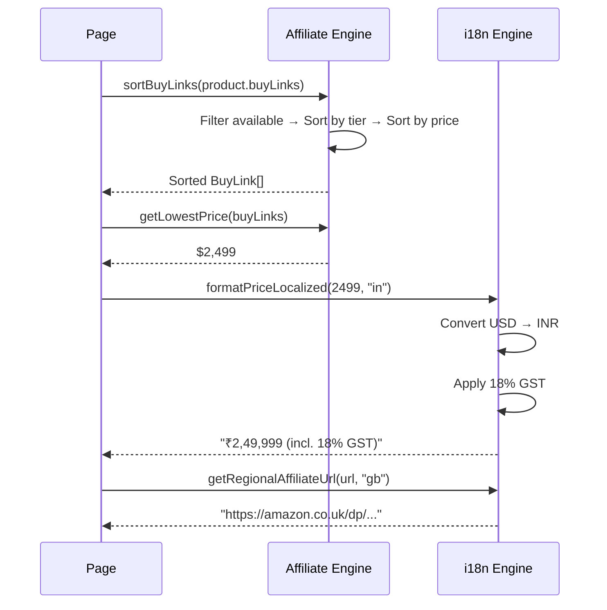

# Affiliate Engine

The affiliate engine manages multi-merchant buy links, pricing logic, and regional affiliate URL rewriting. It is integrated with the i18n system for locale-aware pricing and store links.

---

## Architecture

```
engine/affiliate/index.ts   # Merchant ranking, sorting, pricing
engine/i18n/pricing.ts       # Regional pricing, currency conversion, affiliate URLs
```

---

## Merchant Priority Ranking

Merchants are ranked in 3 tiers:

| Tier | Merchants | Priority |
|------|-----------|----------|
| 1 | Amazon, Apple, Flipkart | 1 (highest) |
| 2 | Croma, Reliance Digital, Best Buy | 2 |
| 3 | B&H Photo | 3 (lowest) |

---

## Buy Link Sorting

`sortBuyLinks(buyLinks)` sorts by:
1. Availability — available links first
2. Merchant priority — tier 1 merchants before tier 2
3. Price — ascending

```typescript
function sortBuyLinks(buyLinks: BuyLink[]): BuyLink[]
```

---

## Pricing Functions

```typescript
// Lowest price among available links
function getLowestPrice(buyLinks: BuyLink[]): number | null

// Savings percentage vs original price
function getSavings(price: number, originalPrice: number): number | null

// Price formatting
function formatPrice(price: number, currency: string): string
// → "$2,499" | "₹2,49,999" | "£1,999"
```

---

## Regional Affiliate URLs

The i18n engine rewrites Amazon affiliate URLs per region:

```typescript
function getRegionalAffiliateUrl(
  originalUrl: string,
  targetRegion: RegionCode
): string
// amazon.com → amazon.co.uk (for gb region)
// amazon.com → amazon.de (for de region)
// amazon.com → amazon.co.jp (for jp region)
```

---

## Regional Pricing

```typescript
function convertPrice(priceUSD: number, targetCurrency: string): number
// Uses built-in fallback exchange rates

function formatPriceLocalized(
  priceUSD: number,
  regionCode: string,
  showTax?: boolean
): string
// → "$2,499 (est. tax $274)"
// → "₹2,49,999 (incl. 18% GST)"
```

### Region Configurations

| Region | Locale | Currency | Symbol | Tax Rate | Tax Label | Affiliate Domain |
|--------|--------|----------|--------|----------|-----------|------------------|
| US | en-US | USD | $ | 0% | — | amazon.com |
| GB | en-GB | GBP | £ | 20% | VAT | amazon.co.uk |
| IN | en-IN | INR | ₹ | 18% | GST | amazon.in |
| DE | de-DE | EUR | € | 19% | MwSt | amazon.de |
| AU | en-AU | AUD | A$ | 10% | GST | amazon.com.au |
| JP | ja-JP | JPY | ¥ | 10% | Tax | amazon.co.jp |

---

## BuyLink Schema

```typescript
interface BuyLink {
  store: string        // Store name (e.g., "Amazon", "Best Buy")
  url: string          // Affiliate URL
  price: number        // Current price
  currency: string     // Currency code (e.g., "USD")
  available: boolean   // In stock?
  badge?: string       // Optional badge ("Best Price", "Sale")
}
```

---

## Data Flow



---

## Usage in Components

```tsx
import { sortBuyLinks, getLowestPrice, getSavings } from '@/engine/affiliate'
import { formatPriceLocalized } from '@/engine/i18n/pricing'

function BuyOptions({ product }: { product: Product }) {
  const sortedLinks = sortBuyLinks(product.buyLinks)
  const lowestPrice = getLowestPrice(sortedLinks)
  const savings = getSavings(lowestPrice!, product.originalPrice!)

  return (
    <div>
      {sortedLinks.map(link => (
        <BuyLinkCard
          key={link.store}
          store={link.store}
          price={formatPriceLocalized(link.price, region)}
          available={link.available}
          badge={link.badge}
        />
      ))}
    </div>
  )
}
```
