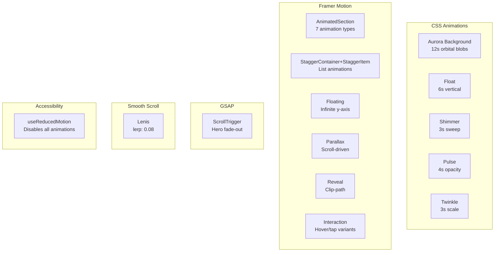

# Animation System

The animation system combines three layers: CSS animations for background effects, Framer Motion for component-level animations, and GSAP for scroll-driven hero transitions. Lenis provides smooth scrolling.

---

## Layers



---

## CSS Animations

Defined in `src/app/globals.css`:

| Class | Duration | Effect |
|-------|----------|--------|
| `aurora-slow` | 12s | Large orbital blob movement |
| `aurora-medium` | 10s | Medium orbital blob movement |
| `aurora-fast` | 8s | Small orbital blob movement |
| `float` | 6s | Vertical oscillation (-16px) |
| `shimmer` | 3s | Horizontal gradient sweep |
| `pulse-soft` | 4s | Gentle opacity pulse |
| `twinkle` | 3s | Scale + opacity twinkle |

---

## Framer Motion Engine (`src/engine/animation/index.ts`)

### Shared Transitions

```typescript
transitions.spring  // { type: "spring", stiffness: 100, damping: 20 }
transitions.smooth  // { duration: 0.6, ease: [0.25, 0.1, 0.25, 1] }
transitions.fast    // { duration: 0.3, ease: "easeOut" }
transitions.slow    // { duration: 1, ease: [0.25, 0.1, 0.25, 1] }
```

### Animation Variants

| Variant | Initial | Animate |
|---------|---------|---------|
| `fadeIn` | opacity: 0 | opacity: 1 |
| `fadeInUp` | opacity: 0, y: 40 | opacity: 1, y: 0 |
| `fadeInDown` | opacity: 0, y: -40 | opacity: 1, y: 0 |
| `fadeInLeft` | opacity: 0, x: -40 | opacity: 1, x: 0 |
| `fadeInRight` | opacity: 0, x: 40 | opacity: 1, x: 0 |
| `scaleIn` | opacity: 0, scale: 0.9 | opacity: 1, scale: 1 |
| `slideInUp` | y: 60 | y: 0 (no opacity) |

### Interaction Variants

```typescript
cardHover     // whileHover: { scale: 1.02, y: -4 }
buttonRipple  // whileTap: { scale: 0.97 }
```

### Special Variants

```typescript
reveal        // clip-path: inset(0 100% 0 0) → inset(0 0 0 0)
floating      // y: 0 → -10 → 0 (infinite loop)

staggerContainer  // staggerChildren: 0.1
staggerItem       // Uses parent's stagger timing
```

---

## Animation Components

| Component | Animation Type | Props |
|-----------|---------------|-------|
| `AnimatedSection` | FadeIn / FadeInUp / FadeInDown / FadeInLeft / FadeInRight / ScaleIn / SlideInUp | `type`, `delay`, `duration`, `once` |
| `FadeIn` | Fade-in | `className`, `delay` |
| `ScaleIn` | Scale-in | `className`, `delay` |
| `SlideIn` | Directional slide | `className`, `delay`, `direction` |
| `Reveal` | Clip-path reveal | `className`, `width`, `delay` |
| `Floating` | Infinite y-axis float | `className`, `amplitude`, `duration`, `delay` |
| `Parallax` | Scroll-driven parallax | `className`, `speed`, `offset` |
| `StaggerContainer` | Stagger wrapper | `className`, `staggerDelay` |
| `StaggerItem` | Stagger child | `className` |

---

## Scroll Animations

### GSAP ScrollTrigger (Hero)

The `Hero` component uses GSAP's ScrollTrigger to fade out the hero as the user scrolls:

```typescript
useGSAP(() => {
  ScrollTrigger.create({
    trigger: heroRef.current,
    start: 'top top',
    end: 'bottom top',
    onUpdate: (self) => {
      gsap.set(heroRef.current, { opacity: 1 - self.progress * 1.5 })
    }
  })
})
```

### Lenis Smooth Scroll

```typescript
<LenisProvider>
  {/* All content */}
</LenisProvider>
```

Configuration: `lerp: 0.08`, `wheelMultiplier: 0.8`, `touchMultiplier: 1.2`

---

## Accessibility

The `useReducedMotion` hook detects `prefers-reduced-motion: reduce`:

```typescript
const prefersReducedMotion = useReducedMotion()
// When true:
//   - AnimatedSection renders children without motion
//   - All Framer Motion variants become instant
//   - GSAP ScrollTrigger is disabled
//   - Lenis is disabled
```

---

## Usage Examples

```tsx
// Fade in on scroll (once)
<AnimatedSection type="fadeInUp" once>
  <h1>Content appears with upward fade</h1>
</AnimatedSection>

// Staggered list
<StaggerContainer>
  {items.map(item => (
    <StaggerItem key={item.id}>
      <Card>{item.name}</Card>
    </StaggerItem>
  ))}
</StaggerContainer>

// Hover card
<Card hover>
  <p>Lifts on hover</p>
</Card>

// Infinite float
<Floating amplitude={15} duration={4}>
  <Icon />
</Floating>

// Scroll parallax
<Parallax speed={0.5}>
  
</Parallax>

// Clip-path reveal
<Reveal delay={0.3}>
  <div>Revealed from left to right</div>
</Reveal>
```
