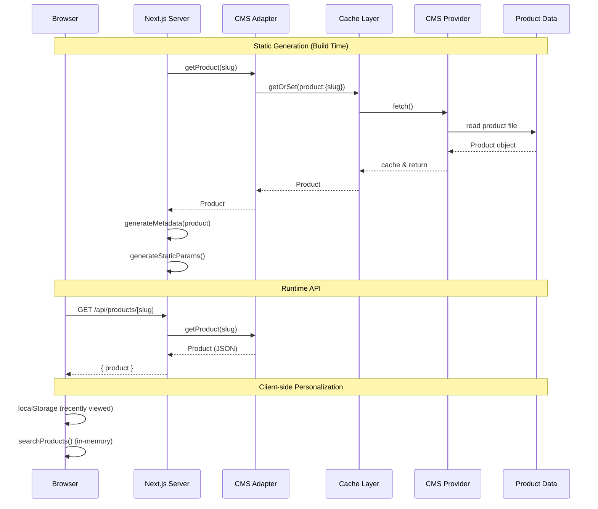
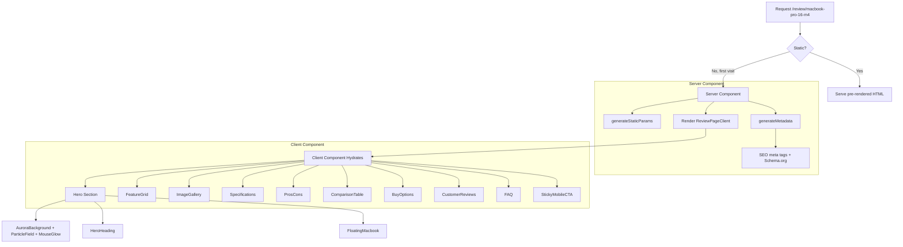
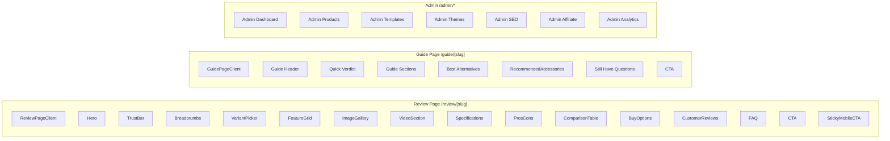
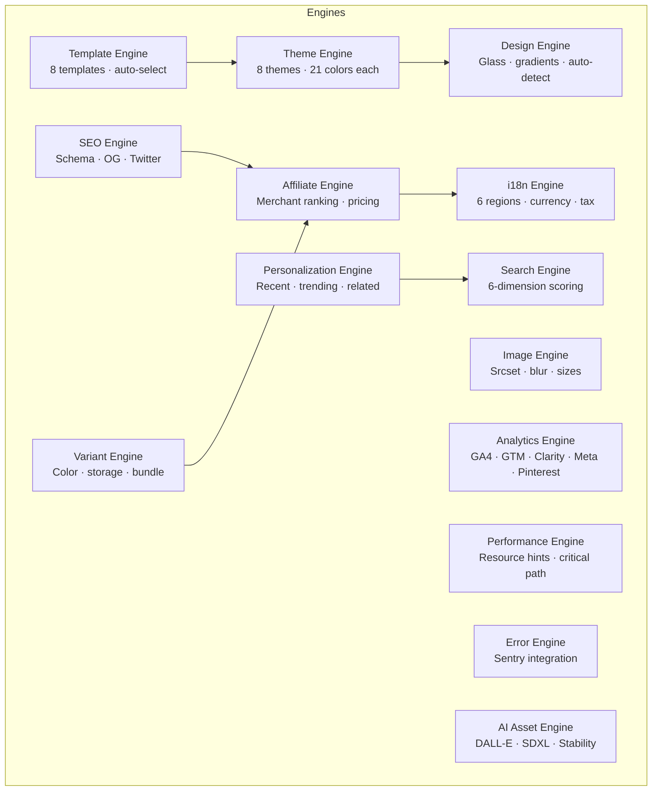
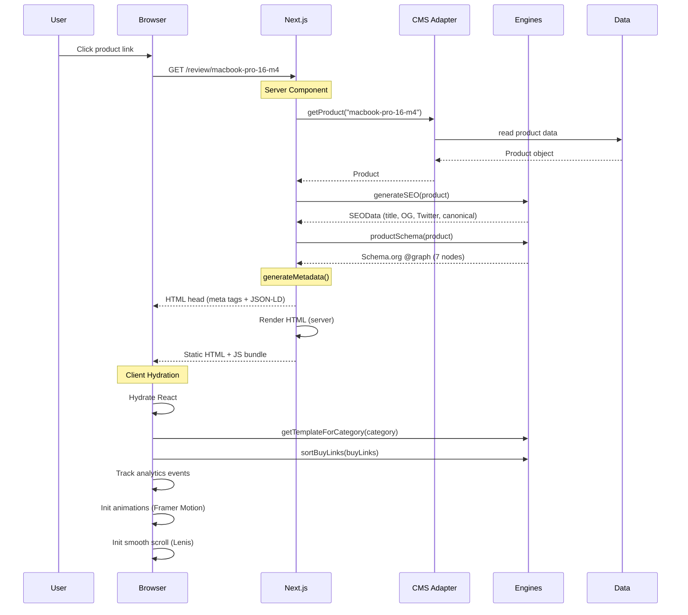

# Architecture

## Layered Architecture (DAG)

The codebase enforces a **strict unidirectional dependency graph**. No layer may import from a layer above it.

```
┌─────────────────────────────────────────────────────────────────────┐
│                        app/ (Pages)                                │
│  Server Components · Client Components · API Routes · Metadata     │
│  generateStaticParams · generateMetadata                           │
└────────────────────────┬────────────────────────────────────────────┘
                         │ imports
                         ▼
┌─────────────────────────────────────────────────────────────────────┐
│                     components/ (UI Layer)                          │
│  Hero · Cards · Gallery · Sections · SEO · Providers               │
│  Animation wrappers · Search · Layout · i18n                       │
└────────────────────────┬────────────────────────────────────────────┘
                         │ imports
                         ▼
┌─────────────────────────────────────────────────────────────────────┐
│                      engine/ (Logic Layer)                          │
│  theme/ · templates/ · affiliate/ · seo/ · image/ · variant/       │
│  search/ · analytics/ · i18n/ · sentry/ · performance/             │
│  personalization/ · design/ · product/ (types) · assets/ai/        │
└────────────────────────┬────────────────────────────────────────────┘
                         │ imports
                         ▼
┌─────────────────────────────────────────────────────────────────────┐
│                    cms/ + data/ (Data Layer)                        │
│  CMS providers · Cache · Adapters · Product data files             │
└─────────────────────────────────────────────────────────────────────┘
```

**Rules:**
- `app/` may import from `components/`, `engine/`, `cms/`, `data/`, `lib/`, `hooks/`
- `components/` may import from `engine/`, `hooks/`, `lib/`
- `engine/` may import from nothing outside `engine/` (pure logic)
- `cms/` may import from `engine/` (for types)
- `data/` may import from `engine/` (for types)
- No circular imports are permitted — enforced by tooling

---

## Data Flow



---

## Rendering Flow



---

## Component-Page Relationship



---

## Engine Architecture



---

## Data Flow for a Product Page Request



---

## Key Design Decisions

| Decision | Rationale |
|----------|-----------|
| Strict layered DAG | Prevents circular imports, enforces separation of concerns |
| Single Product type hub | `engine/product/types.ts` imported by 36 files — change schema once |
| CMS provider pattern | Swap data sources with one config change; supports 10 provider types |
| Template auto-selection | `getTemplateForCategory(category)` maps products to layouts without manual config |
| Server/client split | Data fetching and metadata in server components; interactivity in client components |
| Static generation | All product pages pre-rendered at build time via `generateStaticParams()` |
| Inline SVG blur placeholders | Zero network requests for image placeholders |
| Analytics multi-provider | Push to all configured providers simultaneously from one `trackEvent()` call |
| Theme as CSS custom properties | Themes inject variables on `:root` — no runtime CSS generation |
| Personalization via localStorage | Recently viewed persists across sessions without a backend |

---

## Future Extension Points

- **New CMS provider** — Implement `ProductProvider` interface in `src/cms/providers/` and register it
- **New template** — Add a `TemplateConfig` entry in `src/engine/templates/`
- **New theme** — Add a `ThemeConfig` entry in `src/engine/theme/themes.ts`
- **New AI provider** — Add generation logic in `src/engine/assets/ai/` and register in `createAIAssetEngine()`
- **New analytics provider** — Add push function in `src/engine/analytics/provider.ts`
- **New locale** — Add region config in `src/engine/i18n/config.ts`
- **New product data source** — Implement `ProductProvider` interface and swap CMS config
- **Custom page type** — Follow the review/guide page pattern: server component → metadata → client component
