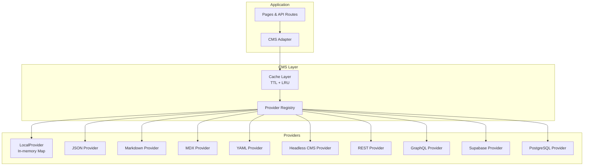

# CMS Abstraction

The CMS layer abstracts all data access behind a unified `ProductProvider` interface. This lets the entire application switch data sources by changing a single line of configuration.

---

## Architecture



---

## Provider Interface

Every provider implements `ProductProvider`:

```typescript
interface ProductProvider {
  // Required
  getProduct(slug: string): Promise<Product | null>
  getAllProducts(): Promise<Product[]>
  getProductsByCategory(category: string): Promise<Product[]>
  getProductsByBrand(brand: string): Promise<Product[]>
  searchProducts(query: string): Promise<Product[]>
  getCategories(): Promise<string[]>
  getBrands(): Promise<string[]>
  getProductCount(): Promise<number>

  // Optional (read-only providers can skip these)
  createProduct?(product: Omit<Product, 'slug'>): Promise<Product>
  updateProduct?(slug: string, data: Partial<Product>): Promise<Product | null>
  deleteProduct?(slug: string): Promise<boolean>
}
```

---

## Configuration

Set the active provider in `src/cms/config.ts`:

```typescript
const cmsConfig = {
  provider: { id: 'local', name: 'Local TypeScript' },
  cache: {
    ttl: 300_000,      // 5 minute cache TTL
    maxSize: 1000       // Max cache entries (LRU eviction)
  }
}
```

---

## Cache Layer

The cache wraps every provider with:

- **TTL-based expiration** — entries expire after configured duration (default 5 min)
- **LRU eviction** — when `maxSize` is reached, least recently used entries are evicted
- **Pattern invalidation** — `invalidate('product:*')` clears all product caches
- **Automatic invalidation** — `createProduct`, `updateProduct`, `deleteProduct` all invalidate cache automatically

```typescript
// Cache key prefix
const CACHE_PREFIX = 'product:'

// Example: cache all products under one key
cache.getOrSet('product:all', () => provider.getAllProducts(), ttl)
```

---

## Adapter

The adapter (`src/cms/adapters/index.ts`) is a thin singleton that instantiates the cache + provider once and exports 13 typed functions:

```typescript
export const {
  getProduct,
  getAllProducts,
  getProductsByCategory,
  getProductsByBrand,
  searchProducts,
  getCategories,
  getBrands,
  getProductCount,
  createProduct,
  updateProduct,
  deleteProduct
} = createCMSAdapter()
```

Used throughout the application: `import { getProduct } from '@/cms/adapters'`

---

## Local Provider

The default provider reads products from `src/data/products/registry.ts`:

```typescript
// registry.ts
export const products: ProductCatalog = {
  'macbook-pro-16-m4': { /* full product data */ }
}
```

The `LocalProvider` wraps this in a `Map<string, Product>` and implements all required methods (filter by category/brand, search, count, full CRUD via the in-memory map).

---

## Provider Registry

Providers are registered via a factory pattern:

```typescript
// src/cms/providers/index.ts
registerProvider('local', () => new LocalProvider())
registerProvider('json', () => new JSONProvider())
registerProvider('supabase', () => new SupabaseProvider())
// ...

export function createProvider(id: ProviderId): ProductProvider {
  // Creates provider by ID, falls back to LocalProvider
}
```

---

## How to Add a New CMS Provider

1. Create a new file in `src/cms/providers/`:

```typescript
// src/cms/providers/supabase.ts
import { createClient } from '@supabase/supabase-js'
import type { ProductProvider } from '../types'

export class SupabaseProvider implements ProductProvider {
  private client

  constructor() {
    this.client = createClient(
      process.env.SUPABASE_URL!,
      process.env.SUPABASE_KEY!
    )
  }

  async getProduct(slug: string): Promise<Product | null> {
    const { data } = await this.client
      .from('products')
      .select('*')
      .eq('slug', slug)
      .single()
    return data
  }

  // ... implement remaining 9 methods
}
```

2. Register it in `src/cms/providers/index.ts`:

```typescript
import { SupabaseProvider } from './supabase'
registerProvider('supabase', () => new SupabaseProvider())
```

3. Update the `ProviderId` type in `src/cms/types/index.ts`:

```typescript
export type ProviderId = 'local' | 'json' | 'markdown' | 'mdx' | 'yaml'
  | 'headless' | 'rest' | 'graphql' | 'supabase' | 'postgresql'
```

4. Switch the config in `src/cms/config.ts`:

```typescript
provider: { id: 'supabase', name: 'Supabase' }
```

No other code changes needed — all pages, API routes, and admin panels use the adapter interface.
