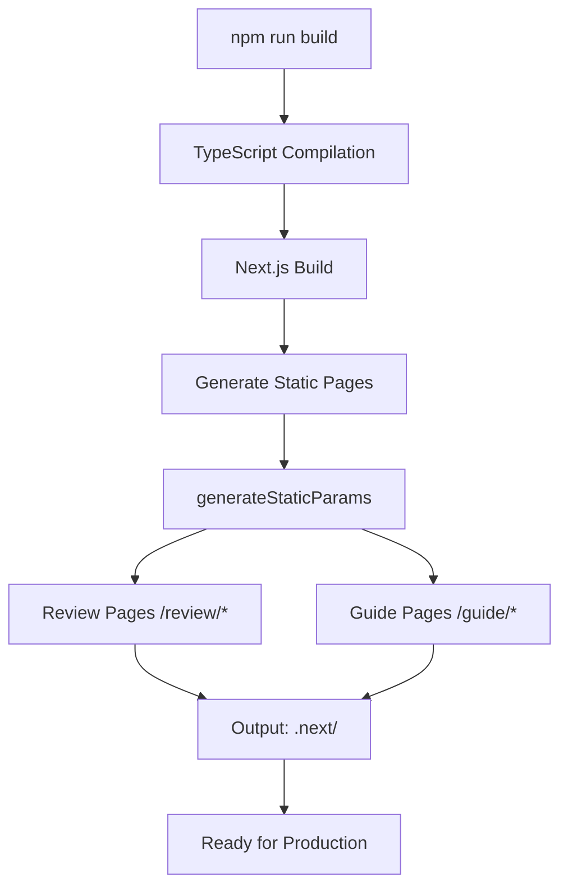
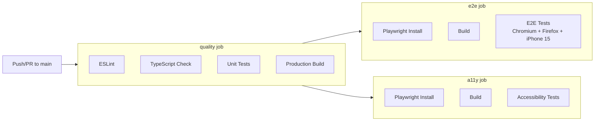

# Deployment

## Prerequisites

- Node.js 20+
- npm 10+

---

## Build Process



### Build Steps

```bash
# 1. Type check
npm run typecheck

# 2. Run unit tests
npm run test:run

# 3. Lint
npm run lint

# 4. Production build
npm run build

# 5. (Optional) E2E tests
npx playwright install --with-deps
npm run test:e2e
```

---

## CI/CD Pipeline

The CI pipeline runs on push/PR to `main` (`.github/workflows/ci.yml`):



### Jobs

**Quality** (always runs):
- `npm run lint`
- `npm run typecheck`
- `npm test -- --run`
- `npm run build`

**E2E** (after quality):
- Installs Playwright browsers with system dependencies
- Builds the application
- Runs Playwright tests across 3 projects: Chromium, Firefox, iPhone 15
- 2 retries, trace on first retry, screenshot on failure

**A11y** (after quality):
- Installs Playwright Chromium
- Builds the application
- Runs accessibility-specific E2E tests

---

## Environment Variables

| Variable | Required | Description |
|----------|----------|-------------|
| `NEXT_PUBLIC_SITE_URL` | Yes | Canonical site URL (default: `https://geetai.com`) |
| `NEXT_PUBLIC_SENTRY_DSN` | No | Sentry Data Source Name for error tracking |
| `NEXT_PUBLIC_GA_ID` | No | Google Analytics 4 measurement ID |
| `NEXT_PUBLIC_GTM_ID` | No | Google Tag Manager container ID |
| `NEXT_PUBLIC_CLARITY_ID` | No | Microsoft Clarity project ID |
| `NEXT_PUBLIC_META_PIXEL_ID` | No | Meta Pixel ID |
| `NEXT_PUBLIC_PINTEREST_TAG` | No | Pinterest conversion tag ID |

---

## Deployment Targets

### Vercel (Recommended)

```bash
npm i -g vercel
vercel --prod
```

The `next.config.ts` is already configured for Vercel. Environment variables can be set in the Vercel dashboard.

### Docker

```dockerfile
FROM node:20-alpine AS builder
WORKDIR /app
COPY package*.json ./
RUN npm ci
COPY . .
RUN npm run build

FROM node:20-alpine AS runner
WORKDIR /app
COPY --from=builder /app/.next ./.next
COPY --from=builder /app/public ./public
COPY --from=builder /app/package*.json ./
RUN npm ci --production
EXPOSE 3000
CMD ["npm", "run", "start"]
```

### Node.js (manual)

```bash
npm run build
npm run start
# Serves on http://localhost:3000
```

---

## Static Export

The application uses `generateStaticParams` for product pages, making all review and guide pages pre-renderable at build time. For a fully static export:

```bash
# next.config.ts
const nextConfig = {
  output: 'export',
  // ...
}
```

```bash
npm run build
# Output in out/
```

---

## Post-Deployment Checklist

- [ ] All product pages return 200 (`/review/*`, `/guide/*`)
- [ ] RSS feed validates at `/rss.xml`
- [ ] Sitemap is accessible at `/sitemap.xml`
- [ ] Robots.txt serves correct rules at `/robots.txt`
- [ ] API endpoints respond (`/api/products`)
- [ ] Admin panel loads (`/admin`)
- [ ] Search functionality works
- [ ] Schema.org JSON-LD validates via Google Rich Results Test
- [ ] Open Graph preview works on social media
- [ ] Analytics events fire correctly
- [ ] Affiliate links point to correct regional stores
