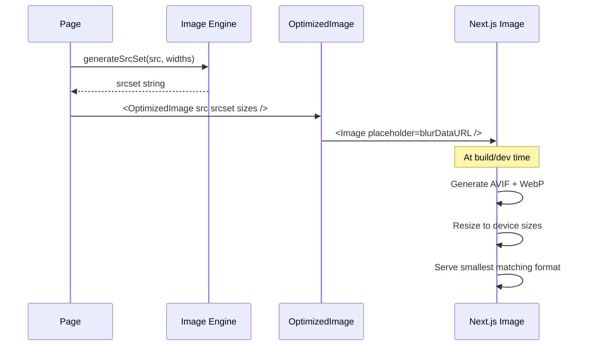

# Image Engine

The image engine handles responsive image generation, blur placeholder creation, and provides an optimized `<Image>` component wrapper.

---

## Architecture

```
engine/image/index.ts       # Core logic: srcset, sizes, blur placeholders
components/ui/OptimizedImage.tsx  # Next.js Image wrapper
```

---

## Image Engine (`engine/image/index.ts`)

### Responsive Images

```typescript
function generateSrcSet(
  src: string,
  widths: number[] = [480, 768, 1024, 1440, 1920]
): string
// → "/image.jpg?w=480 480w, /image.jpg?w=768 768w, ..."

function generateSizes(breakpoints: Record<string, number>): string
// → "(max-width: 768px) 100vw, (max-width: 1200px) 50vw, 33vw"

function generateImageSizes(width: number, height: number): {
  aspectRatio: number
  srcset: string
  sizes: string
}
```

### Blur Placeholders

```typescript
function getPlaceholderBlur(
  width: number = 40,
  height: number = 30
): string
// → "data:image/svg+xml;base64,..." (inline SVG blur)
```

Generates an inline SVG data URI that serves as a blur-up placeholder. Zero network requests.

---

## OptimizedImage Component

A production wrapper around Next.js `<Image>`:

```tsx
<OptimizedImage
  src="/products/macbook-pro.jpg"
  alt="MacBook Pro 16-inch"
  width={1200}
  height={800}
  priority={false}       // Lazy load by default
  className="rounded-lg"
  sizes="(max-width: 768px) 100vw, 50vw"
/>
```

### Features

- **Blur placeholder** — Auto-generated inline SVG data URI (no network request)
- **Lazy loading** — `loading="lazy"` by default, `priority` flag for above-fold images
- **Responsive** — Accepts `sizes`, generates appropriate image attributes
- **Next.js optimization** — AVIF, WebP format negotiation, device-aware resizing
- **Container-aware** — `fill` prop support with optional `containerClassName` for aspect-ratio boxes

### Next.js Image Configuration

```typescript
// next.config.ts
const nextConfig = {
  images: {
    formats: ['image/avif', 'image/webp'],
    deviceSizes: [480, 768, 1024, 1440, 1920],
  }
}
```

---

## Data Flow


