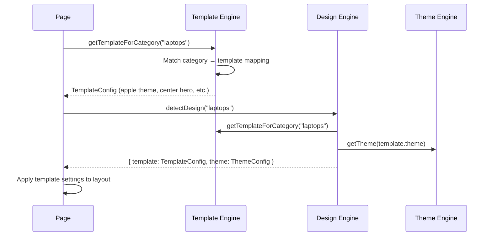

# Template Registry

The template engine maps product categories to pre-configured layout templates. Templates control hero layout, gallery style, CTA styling, card appearance, animation intensity, typography, and background effects.

---

## Architecture

```
engine/templates/index.ts   # 8 TemplateConfig entries + auto-selector
engine/theme/themes.ts       # Templates reference themes
engine/design/ai.ts          # Auto-detect template from category
```

---

## Available Templates

| Template | Categories | Theme | Hero | Gallery | CTA | Animation |
|----------|-----------|-------|------|---------|-----|-----------|
| laptop | laptops, computers, tablets | apple | center | grid | gradient | moderate |
| phone | phones, smartphones, mobile | tech | full-image | carousel | outline | high |
| watch | watches, wearables | luxury-dark | split | masonry | pill | subtle |
| camera | cameras, photography | minimal-white | full-image | grid | gradient | moderate |
| perfume | fragrance, perfume, beauty | fashion | minimal | stacked | bordered | subtle |
| audio | audio, headphones, speakers | gaming | center | grid | gradient | high |
| health | health, fitness, wellness | health | split | grid | outline | moderate |
| finance | finance, business, software | finance | minimal | grid | gradient | subtle |

---

## Template Configuration Shape

```typescript
interface TemplateConfig {
  id: string
  name: string
  theme: ThemeId                    // Which theme to use
  heroLayout: 'center' | 'split' | 'full-image' | 'minimal'
  galleryStyle: 'grid' | 'carousel' | 'masonry' | 'stacked'
  ctaStyle: 'gradient' | 'outline' | 'pill' | 'bordered'
  cardStyle: 'glass' | 'solid' | 'border' | 'elevated'
  animationIntensity: 'subtle' | 'moderate' | 'high'
  typographyScale: 'compact' | 'normal' | 'expressive'
  backgroundEffect: 'aurora' | 'grid' | 'gradient' | 'solid'
}
```

---

## Auto-Selection

The template engine auto-selects a template based on product category:

```typescript
function getTemplateForCategory(category: string): TemplateConfig
// → Returns best-matching template
// → Falls back to 'laptop' template if no match
```

The `detectDesign` utility in the design engine combines template + theme selection:

```typescript
function detectDesign(category: string): {
  template: TemplateConfig
  theme: ThemeConfig
}
// Returns both the template and its associated theme
```

---

## Data Flow



---

## How to Create a New Template

1. Open `src/engine/templates/index.ts` and add a new entry:

```typescript
const templateConfigs: TemplateConfig[] = [
  // ... existing 8 templates
  {
    id: 'console',
    name: 'Gaming Console',
    theme: 'gaming',
    heroLayout: 'center',
    galleryStyle: 'carousel',
    ctaStyle: 'gradient',
    cardStyle: 'glass',
    animationIntensity: 'high',
    typographyScale: 'expressive',
    backgroundEffect: 'aurora'
  }
]
```

2. Add category mapping in `getTemplateForCategory()`:

```typescript
const categoryMap: Record<string, string> = {
  'console': 'console',
  'gaming': 'console',
  // ...
}
```

3. Optionally update the auto-detect in `src/engine/design/ai.ts` to include your new categories.

The template is now active — any product with a matching category will use it automatically.
