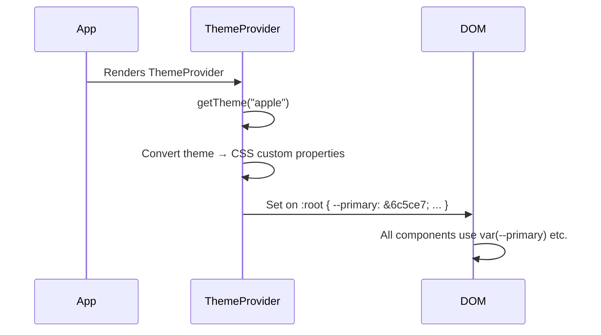

# Theme Engine

The theme engine provides a complete design token system with 8 pre-built themes. Themes are injected as CSS custom properties on `:root` via the `ThemeProvider` component, requiring zero runtime CSS generation.

---

## Architecture

```
engine/theme/
├── types.ts    # ThemeConfig type definitions (21 colors, 7 typography, etc.)
├── themes.ts   # 8 complete theme definitions
└── config.ts   # Active theme selection + getTheme() accessor
```

```
components/providers/ThemeProvider.tsx  # Injects theme as CSS custom properties
```

---

## Available Themes

| Theme | ID | Radius | Accent | Vibe |
|-------|-----|--------|--------|------|
| Apple | `apple` | 12px | `#6c5ce7` (purple) | Dark glassmorphism |
| Luxury Dark | `luxury-dark` | 8px | `#c9a96e` (gold) | Premium, dark |
| Minimal White | `minimal-white` | 16px | `#0071e3` (blue) | Clean, light |
| Gaming | `gaming` | 4px | `#ff6b6b→#a855f7` (pink-purple) | Energetic, dark |
| Tech | `tech` | 10px | `#0070f3→#7928ca` (blue-purple) | Modern, dark |
| Fashion | `fashion` | 20px | `#d4a574` (warm) | Elegant, light |
| Health | `health` | 14px | `#059669` (green) | Natural, light |
| Finance | `finance` | 6px | `#1e3a5f` (navy) | Corporate, light |

---

## Theme Configuration Shape

```typescript
interface ThemeConfig {
  name: string
  id: ThemeId
  colors: ThemeColors    // 21 color slots
  typography: ThemeTypography  // 7 properties
  glass: ThemeGlass      // 5 glass properties
  animation: ThemeAnimation  // 6 animation properties
  layout: ThemeLayout    // 4 layout properties
  radius: string
}
```

### Color Slots (ThemeColors)

```typescript
interface ThemeColors {
  // Brand
  primary: string        // Main brand color
  secondary: string      # Secondary accent
  accent: string         // Highlight color

  // Background
  bg: {                  // Background layers
    primary: string
    secondary: string
    tertiary: string
    card: string
    elevated: string
    overlay: string
  }

  // Text
  text: {
    primary: string
    secondary: string
    muted: string
    inverse: string
  }

  // Borders
  border: {
    light: string
    default: string
    strong: string
  }

  // Status
  status: {
    success: string
    warning: string
    error: string
    info: string
  }

  // Interactive
  interactive: {
    hover: string
    active: string
    disabled: string
  }
}
```

### Typography (ThemeTypography)

```typescript
interface ThemeTypography {
  fontFamily: string       // Font stack
  headingFont: string      // Heading-specific font
  mono: string             // Monospace font
  scale: 'compact' | 'normal' | 'expressive'
  lineHeight: {
    tight: string
    normal: string
    relaxed: string
  }
  weight: {
    normal: number
    medium: number
    bold: number
  }
}
```

### Glass Properties (ThemeGlass)

```typescript
interface ThemeGlass {
  background: string       // RGBA backdrop
  border: string           // RGBA border
  blur: string             // Blur amount (px)
  shadow: string           // Box shadow
  hover: string            // Hover state background
}
```

### Animation Properties (ThemeAnimation)

```typescript
interface ThemeAnimation {
  ease: string             // CSS ease curve
  springStiffness: number  // Framer Motion spring stiffness
  springDamping: number    // Framer Motion spring damping
  durationFast: string     // Fast transitions (s)
  durationNormal: string   // Normal transitions (s)
  durationSlow: string     // Slow transitions (s)
}
```

### Layout Properties (ThemeLayout)

```typescript
interface ThemeLayout {
  maxWidth: string         // Container max-width
  padding: string          // Section padding
  gridGap: string          // Grid gap
  sectionGap: string       // Gap between sections
}
```

---

## How Themes Are Applied



The `ThemeProvider` component iterates over the theme config and sets each value as a CSS custom property:

```
--primary: #6c5ce7
--secondary: #a29bfe
--accent: #ff7675
--bg-primary: #0a0a0f
--text-primary: #f5f5f7
--glass-bg: rgba(255, 255, 255, 0.05)
--glass-border: rgba(255, 255, 255, 0.1)
--glass-blur: 12px
... (all 80+ properties)
```

---

## How to Create a New Theme

1. Open `src/engine/theme/types.ts` and add your theme ID to the `ThemeId` union:

```typescript
export type ThemeId = 'apple' | 'luxury-dark' | 'minimal-white' | 'gaming'
  | 'tech' | 'fashion' | 'health' | 'finance' | 'your-theme'
```

2. Add a full theme definition in `src/engine/theme/themes.ts`:

```typescript
export const yourTheme: ThemeConfig = {
  name: 'Your Theme',
  id: 'your-theme',
  radius: '10px',
  colors: {
    primary: '#your-color',
    secondary: '#your-accent',
    accent: '#your-highlight',
    bg: {
      primary: '#color',
      secondary: '#color',
      tertiary: '#color',
      card: '#color',
      elevated: '#color',
      overlay: 'rgba(...)'
    },
    text: {
      primary: '#color',
      secondary: '#color',
      muted: '#color',
      inverse: '#color'
    },
    border: {
      light: 'rgba(...)',
      default: 'rgba(...)',
      strong: 'rgba(...)'
    },
    status: {
      success: '#color',
      warning: '#color',
      error: '#color',
      info: '#color'
    },
    interactive: {
      hover: 'rgba(...)',
      active: 'rgba(...)',
      disabled: 'rgba(...)'
    }
  },
  typography: { /* ... */ },
  glass: { /* ... */ },
  animation: { /* ... */ },
  layout: { /* ... */ }
}
```

3. Add to the `themes` object and update `themeNames` array in the same file.

4. Set it as active in `src/engine/theme/config.ts`:

```typescript
export const ACTIVE_THEME: ThemeId = 'your-theme'
```

5. Optionally create a template-to-theme mapping in `src/engine/templates/index.ts`.

---

## Design Utilities

The design engine (`src/engine/design/index.ts`) provides helpers that use theme tokens:

```typescript
import { glassClasses, gradientText, sectionPadding, cn } from '@/engine/design'

// Generate glass effect class string
glassClasses() // → "backdrop-blur-[12px] bg-[rgba(255,255,255,0.05)] ..."

// Generate gradient text class
gradientText() // → "bg-gradient-to-r from-[var(--primary)] ..."

// Section padding
sectionPadding() // → "py-16 md:py-24"
```
